Link Deploy : https://wildan-al41-sultansport.pbp.cs.ui.ac.id/

Tugas 2

1.  Jelaskan bagaimana cara kamu mengimplementasikan 
checklist di atas secara step-by-step (bukan hanya sekadar mengikuti tutorial).

Sebelum masuk ke bagian cheklist, saya membuat repository baru bernama sultan-sport yang akan digunakan untuk mengerjakan tugas ini

    a. Membuat sebuah proyek Django baru.

        Saya mendownload semua requirements untuk django terlebih dahulu, detailnya ada di file requirement.txt
        Setelah itu saya membuat proyek django bernama sultan_sport serta mengkonfigurasikan variables dan proyek django nya

    b. Membuat aplikasi dengan nama main pada proyek tersebut.

        Saya membuat aplikasi baru bernama main dalam proyek sultan_sport degan perintah python manage.py startapp main, lalu saya juga mendaftarkan aplikasinya di setting.py di proyek sultan_sport, lebih tepatnya dibagian INSTALLED_APPS

    c. Melakukan routing pada proyek agar dapat menjalankan aplikasi main.

        Untuk melakukan routing, pertama - tama saya membuat berkas urls.py di main, lalu mengisi filenya dengan kode 

        from django.urls import path
        from main.views import show_main

        app_name = 'main'

        urlpatterns = [
            path('', show_main, name='show_main'),
        ]

    d. Membuat model pada aplikasi main dengan nama Product dan memiliki atribut wajib sebagai berikut.

        Dalam membuat model, sebenarnya saya menggunakan template dari tutorial 1, tapi saya merubahnya seperti ketentuan tugas 2, yang saya rubah antara lain, merubah namanya dari News menjadi Product, lalu merubah CATEGORY_CHOICES menjadi PRODUCT_CHOICES serta merubah isi dictionarynya. Saya juga merubah atribut nya seperti ketentuan yang ada di tugas 2 tetapi saya menambahkan 2 atribut baru yaitu adress dan stock

    e. Membuat sebuah fungsi pada views.py untuk dikembalikan ke dalam sebuah template HTML yang menampilkan nama aplikasi serta nama dan kelas kamu.

        Saya membuka berkas views.py di folder main, lalu saya memberikan fungsi show_main yang berisikan nama dan npm saya, lalu di file main.html nya saya panggil kembali nama dan kelas saya dari file views.py, lalu saya menambahkan judul di berkas main.html saya

    f. Membuat sebuah routing pada urls.py aplikasi main untuk memetakan fungsi yang telah dibuat pada views.py.
        
        saya membuka berkas urls.py di folder sultan-sport, saya menambahkan kode

        from django.urls import path, include

        serta menambahkan kode

        path('', include('main.urls')),

        didalam url pattern

    g. Melakukan deployment ke PWS terhadap aplikasi yang sudah dibuat sehingga nantinya dapat diakses oleh teman-temanmu melalui Internet.

        Saya membuka website pws, lalu membuat project baru, lalu saya hubungkan pws itu kedalam proyek saya, awalnya saya bingung kenapa selalu gagal build, ternyata saya lupa untuk ngepush git saya ke pws, ini memakan 1 jaman lebih :' .

2. Buatlah bagan yang berisi request client ke web aplikasi berbasis Django beserta responnya dan jelaskan pada bagan tersebut kaitan antara urls.py, views.py, models.py, dan berkas html.

    

3. Jelaskan peran settings.py dalam proyek Django!

    Dalam proyek Django, settings.py berfungsi sebagai pusat pengaturan utama yang mengendalikan cara aplikasi berjalan. Di dalamnya tersimpan konfigurasi penting, mulai dari aplikasi apa saja yang digunakan, middleware yang aktif, hingga bagaimana proyek terhubung dengan database. File ini juga mengatur aspek keamanan, seperti secret key, daftar host yang diizinkan, serta status debug untuk membedakan antara lingkungan pengembangan dan produksi. Selain itu, settings.py memuat aturan mengenai lokasi file statis dan media, pengaturan bahasa serta zona waktu, bahkan konfigurasi tambahan seperti email, autentikasi, dan logging. Dengan kata lain, settings.py adalah jantung pengaturan proyek Django yang memastikan semua komponen dapat bekerja selaras sesuai kebutuhan aplikasi.

4. Bagaimana cara kerja migrasi database di Django?

    Dalam Django, migrasi database bekerja sebagai jembatan antara model yang ditulis di Python dengan struktur tabel yang ada di database. Setiap kali pengembang membuat atau mengubah model, Django tidak langsung mengubah database, melainkan mencatat perubahan tersebut dalam sebuah file migrasi. File inilah yang berisi instruksi tentang apa yang harus ditambahkan, diubah, atau dihapus di dalam tabel. Setelah itu, ketika migrasi dijalankan, Django menerjemahkan instruksi tersebut menjadi perintah SQL dan mengeksekusinya ke database. Dengan cara ini, database selalu mengikuti perkembangan model tanpa perlu menulis query manual, sekaligus menjaga riwayat perubahan agar mudah dilacak atau dikembalikan jika diperlukan.

5. Menurut Anda, dari semua framework yang ada, mengapa framework Django dijadikan permulaan pembelajaran pengembangan perangkat lunak?

    Django sering dijadikan permulaan dalam pembelajaran pengembangan perangkat lunak karena sifatnya yang terstruktur, lengkap, dan ramah untuk pemula sekaligus kuat untuk proyek nyata. Django membawa filosofi “batteries included”, artinya sebagian besar fitur penting untuk membangun aplikasi web sudah tersedia tanpa perlu memasang banyak tambahan—mulai dari autentikasi pengguna, sistem manajemen database, hingga keamanan dasar. Hal ini membantu pemula agar bisa fokus memahami konsep inti pengembangan perangkat lunak, bukan sibuk dengan detail teknis yang terpecah-pecah.

    Selain itu, Django menerapkan pola arsitektur MTV (Model-Template-View) yang serupa dengan konsep MVC, sehingga pengembang sejak awal terbiasa dengan pembagian tanggung jawab kode secara rapi dan terstruktur. Django juga menekankan praktik terbaik, seperti keamanan default, penggunaan ORM untuk mengelola database, serta dukungan migrasi yang membuat perubahan skema lebih mudah dan terkontrol.

    Dengan dokumentasi yang lengkap, komunitas besar, dan ekosistem yang matang, Django memberi pengalaman belajar yang tidak hanya teoritis, tetapi juga relevan dengan kebutuhan industri. Karena itulah, banyak program atau kursus menjadikannya framework awal agar mahasiswa atau pemula bisa memahami alur kerja sebuah aplikasi web modern secara menyeluruh sebelum melangkah ke teknologi lain yang lebih spesifik atau ringan.

6. Apakah ada feedback untuk asisten dosen tutorial 1 yang telah kamu kerjakan sebelumnya?

    Mungkin jika berkenan, untuk setiap tugas atau tutorial yang telah dilakukan, bisa berikan feedback agar saya tahu dimana kurangnya saya dalam mengerjakan tugas, terimakasih

Tugas 3
1. Jelaskan mengapa kita memerlukan data delivery dalam pengimplementasian sebuah platform?

    Dalam implementasi sebuah platform, data delivery diperlukan untuk memastikan proses pertukaran data antar komponen sistem berjalan dengan baik. Platform umumnya terdiri dari berbagai bagian seperti frontend, backend, database, dan layanan eksternal. Agar seluruh bagian ini dapat bekerja secara terpadu, diperlukan mekanisme yang dapat mengirimkan data secara cepat, aman, dan konsisten.

    Data delivery berperan penting dalam menjaga konsistensi data, sehingga informasi yang dikirimkan tidak hilang atau berubah selama proses pengiriman. Selain itu, mekanisme ini mendukung kebutuhan pemrosesan data secara real-time, yang menjadi ciri banyak platform modern. Dengan adanya data delivery, sistem juga dapat menangani pertumbuhan jumlah pengguna atau beban kerja yang semakin besar, karena arus data dapat diatur dengan efisien.

    Data delivery juga memungkinkan platform untuk berintegrasi dengan layanan pihak ketiga, seperti sistem pembayaran atau API eksternal. Di sisi lain, data yang sampai dengan benar dan tepat waktu dapat dimanfaatkan untuk analisis dan pengambilan keputusan strategis.

    Itulah kenapa data delivery merupakan komponen yang sangat penting dalam pengimplementasian platform, karena menjadi dasar agar sistem dapat berjalan secara andal, terukur, dan mampu memenuhi kebutuhan pengguna.

2. Menurutmu, mana yang lebih baik antara XML dan JSON? Mengapa JSON lebih populer dibandingkan XML?

    Menurut saya, JSON lebih baik dari XML, namun walaupun begitu, XML maupun JSON sama-sama berfungsi sebagai format pertukaran data, tetapi keduanya memiliki karakteristik yang berbeda. XML memiliki struktur berbasis tag yang cukup kompleks, sementara JSON menggunakan format key-value yang lebih sederhana.

    JSON lebih unggul karena lebih ringkas dan efisien. Struktur JSON tidak memerlukan tag pembuka dan penutup seperti pada XML, sehingga ukuran data yang dikirim menjadi lebih kecil. Hal ini tentu menghemat bandwidth sekaligus mempercepat proses pengiriman data. Selain itu, JSON juga lebih mudah dibaca oleh manusia maupun mesin karena sintaksnya mirip dengan objek di banyak bahasa pemrograman.

    Dari sisi implementasi, JSON lebih praktis karena dapat langsung di-parse menjadi objek native pada bahasa pemrograman modern, terutama JavaScript. Hal ini membuat JSON sangat cocok untuk kebutuhan aplikasi web dan mobile yang menuntut kinerja cepat. Sedangkan pada XML, parsing membutuhkan langkah tambahan sehingga cenderung lebih berat.

    Meskipun demikian, XML tetap memiliki kelebihan tertentu. XML mendukung skema, namespace, serta validasi dokumen yang lebih ketat. Fitur ini menjadikan XML lebih cocok digunakan dalam sistem-sistem enterprise atau standar lama yang membutuhkan aturan formal dalam pertukaran data. Karena alasan ini, XML masih digunakan di beberapa sektor, meskipun popularitasnya menurun.

    Secara keseluruhan, JSON lebih populer dibandingkan XML karena kesederhanaan, efisiensi, dan kemudahan integrasinya dengan teknologi modern. Sementara itu, XML masih relevan di beberapa konteks tertentu, terutama pada sistem lama yang sudah terbentuk dan mengandalkan fitur validasinya.

3. Jelaskan fungsi dari method is_valid() pada form Django dan mengapa kita membutuhkan method tersebut?

    Dalam Django, method is_valid() pada form digunakan untuk melakukan validasi terhadap data yang dikirimkan melalui form. Ketika pengguna mengisi form dan mengirimkan data ke server, Django akan menampung data tersebut di dalam objek form. Dengan memanggil is_valid(), Django akan memeriksa apakah data yang masuk sudah sesuai dengan aturan validasi yang didefinisikan pada form, misalnya tipe data, panjang karakter, kewajiban field (required), maupun aturan custom yang kita tentukan sendiri.

    Jika semua data memenuhi aturan validasi, maka is_valid() akan mengembalikan nilai True, dan data yang sudah bersih (cleaned data) bisa diakses melalui atribut form.cleaned_data. Sebaliknya, jika ada data yang tidak valid, maka is_valid() akan mengembalikan False, dan Django secara otomatis akan menyimpan pesan error di dalam objek form. Pesan error ini kemudian bisa ditampilkan kembali ke pengguna agar mereka tahu bagian mana yang perlu diperbaiki.

    Kita membutuhkan method ini karena validasi data merupakan bagian yang sangat penting dalam membangun aplikasi web. Tanpa validasi, data yang masuk ke sistem bisa saja salah, tidak sesuai format, bahkan berpotensi membahayakan aplikasi (misalnya serangan injeksi). Dengan adanya is_valid(), Django membantu developer untuk memastikan hanya data yang valid yang akan diproses dan disimpan ke database.

4.  Mengapa kita membutuhkan csrf_token saat membuat form di Django? Apa yang dapat terjadi jika kita tidak menambahkan csrf_token pada form Django? Bagaimana hal tersebut dapat dimanfaatkan oleh penyerang?

    Dalam Django, csrf_token digunakan untuk melindungi aplikasi dari serangan Cross-Site Request Forgery (CSRF). CSRF adalah jenis serangan di mana penyerang mencoba memanfaatkan sesi pengguna yang masih aktif untuk menjalankan aksi tertentu di aplikasi tanpa sepengetahuan pengguna tersebut.

    Dengan adanya csrf_token, setiap form yang dikirimkan ke server akan menyertakan token unik yang hanya valid untuk sesi pengguna tersebut. Django kemudian akan memverifikasi token ini sebelum memproses data form. Jika token tidak ada atau tidak cocok, maka permintaan akan ditolak.

    Apabila kita tidak menambahkan csrf_token pada form, maka aplikasi menjadi rentan terhadap serangan CSRF. Misalnya, seorang pengguna sedang login di sebuah aplikasi bank berbasis Django. Tanpa perlindungan CSRF, penyerang bisa membuat sebuah halaman berisi form tersembunyi yang, ketika diakses oleh korban, secara otomatis mengirimkan request ke aplikasi bank untuk melakukan transfer uang. Karena pengguna masih login, request tersebut akan dianggap sah oleh server, padahal sebenarnya pengguna tidak pernah berniat melakukan aksi tersebut.

    Dengan kata lain, tanpa csrf_token, penyerang dapat memanfaatkan sesi pengguna yang aktif untuk melakukan tindakan berbahaya seperti mengubah data, melakukan transaksi, atau bahkan mengambil alih akun. Inilah alasan mengapa csrf_token sangat penting untuk keamanan aplikasi web yang dibuat dengan Django.

5.  Jelaskan bagaimana cara kamu mengimplementasikan checklist di atas secara step-by-step (bukan hanya sekadar mengikuti tutorial).

    a. Tambahkan 4 fungsi views baru untuk melihat objek yang sudah ditambahkan dalam format XML, JSON, XML by ID, dan JSON by ID.

        Untuk menambahkan 4 fungsi views, buka dulu views.py, lalu tambahkan didalamnya fungsi fungsi baru tersebut.
    

    b. Membuat routing URL untuk masing-masing views yang telah ditambahkan pada poin 1

        Buka urls.py di folder main, lalu tambahkan routenya didalam urlspattern agar dapat mengakses fungsi views jika ada permintaan
    

    c. Membuat halaman yang menampilkan data objek model yang memiliki tombol "Add" yang akan redirect ke halaman form, serta tombol "Detail" pada setiap data objek model yang akan menampilkan halaman detail objek.

        Update isi main.html dan tambahkan tombol Add Product yang akan mengembalikan halaman create_product.html, 
    
        lalu juga tambahkan tombol detail yang akan mengembalikan fungsi show_product yang mereturn halaman product_detail.html
    

    d.Membuat halaman form untuk menambahkan objek model pada app sebelumnya.

        buat form di forms.py yang memiliki field yang sama seperti yang ada di model
    

    e. Membuat halaman yang menampilkan detail dari setiap data objek model.

        Buat file product_detail.html lalu isi dengan detail yang ingin diperlihatkan ke user
    

6. Mengakses keempat URL di poin 2 menggunakan Postman, membuat screenshot dari hasil akses URL pada Postman, dan menambahkannya ke dalam README.md.

    JSON
    
    
    XML
    

    JSON by Id
    

    XML by Id
    

7. Apakah ada feedback untuk asdos di tutorial 2 yang sudah kalian kerjakan?

    Asdos menjawab pertanyaan dengan detail dan membuat saya menjadi mengerti, namun saya tetap ingin ada update apakah tutorial yang saya kerjakan sudah benar atau tidak setelah deadline nya selesai.

Tugas 4

1. Apa itu Django AuthenticationForm? Jelaskan juga kelebihan dan kekurangannya.

    AuthenticationForm adalah form bawaan dari Django yang digunakan untuk mempermudah proses login atau autentikasi pengguna. Form ini terdapat di modul django.contrib.auth.forms dan secara default memiliki dua field utama, yaitu username dan password. Saat pengguna mengisi form ini, Django secara otomatis melakukan validasi, mulai dari memastikan username terdaftar di database hingga mencocokkan password yang dimasukkan dengan password yang tersimpan. Jika validasi berhasil, form ini akan menghasilkan objek user yang bisa langsung digunakan untuk proses login.

    Kelebihan AuthenticationForm terletak pada kemudahan dan keamanannya. Karena merupakan bagian dari sistem autentikasi bawaan Django, form ini sudah terintegrasi dengan mekanisme keamanan framework, termasuk hashing password dan perlindungan CSRF. Form ini juga dapat diperluas sesuai kebutuhan, misalnya menambahkan field tambahan seperti captcha atau fitur “remember me”. Hal ini membuatnya sangat cocok untuk aplikasi yang membutuhkan login standar tanpa harus membuat form dari awal.

    Namun, AuthenticationForm juga memiliki beberapa keterbatasan. Secara default, form ini hanya mendukung login berbasis username dan password, sehingga kurang fleksibel untuk metode autentikasi modern seperti email, OTP, atau login sosial. Selain itu, pesan error yang ditampilkan cukup standar dan kurang ramah bagi pengguna, sehingga perlu disesuaikan agar pengalaman pengguna lebih baik.

    Secara keseluruhan, AuthenticationForm sangat berguna untuk implementasi login dasar di Django. Untuk kebutuhan autentikasi yang lebih kompleks, biasanya diperlukan kustomisasi tambahan atau integrasi dengan library lain seperti django-allauth.

2. Apa perbedaan antara autentikasi dan otorisasi? Bagaiamana Django mengimplementasikan kedua konsep tersebut?

    Autentikasi dan otorisasi adalah dua konsep penting dalam keamanan sistem, namun memiliki fungsi yang berbeda. Autentikasi adalah proses untuk memverifikasi identitas pengguna, memastikan bahwa orang yang mencoba mengakses sistem benar-benar terdaftar dan sah. Proses ini biasanya menggunakan username dan password, tetapi juga bisa memanfaatkan metode lain seperti token, OTP, atau login melalui akun pihak ketiga. Dengan kata lain, autentikasi menjawab pertanyaan “siapa pengguna ini?” dan menjadi langkah awal sebelum pengguna bisa mengakses sistem.
    
    Sementara itu, otorisasi adalah proses yang menentukan hak akses pengguna setelah identitasnya terverifikasi. Otorisasi menjawab pertanyaan “apa yang boleh dilakukan pengguna ini?”. Seorang pengguna mungkin sudah berhasil login melalui autentikasi, namun tidak semua fitur atau halaman bisa diakses jika hak aksesnya terbatas. Contohnya, hanya pengguna dengan peran admin yang dapat menghapus data atau mengubah pengaturan sistem, sementara pengguna biasa hanya bisa melihat atau menambahkan data tertentu.

    Di Django, autentikasi dan otorisasi diimplementasikan secara terpisah namun saling mendukung. Autentikasi ditangani oleh modul django.contrib.auth yang menyediakan model User, form login seperti AuthenticationForm, serta fungsi authenticate() dan login() untuk memvalidasi identitas pengguna dan membuat sesi login. Setelah pengguna terautentikasi, Django menggunakan sistem otorisasi berbasis permissions dan groups untuk mengatur hak akses. Permissions memungkinkan pengaturan hak spesifik seperti menambah, mengubah, atau menghapus objek, sedangkan groups mempermudah manajemen role dengan mengelompokkan permissions. Middleware dan decorator seperti @login_required atau @permission_required digunakan untuk memastikan hanya pengguna yang memiliki hak yang sesuai dapat mengakses view tertentu. Dengan mekanisme ini, Django memastikan setiap pengguna tidak hanya teridentifikasi, tetapi juga hanya bisa melakukan tindakan yang sesuai dengan hak aksesnya.

3. Apa saja kelebihan dan kekurangan session dan cookies dalam konteks menyimpan state di aplikasi web?

    Dalam pengembangan aplikasi web, session dan cookies sering digunakan untuk menyimpan state atau informasi pengguna agar aplikasi bisa “ingat” kondisi tertentu, misalnya status login. Masing-masing memiliki kelebihan dan kekurangan.

    Session menyimpan data di sisi server, biasanya di memory atau database, sementara browser hanya menyimpan session ID. Kelebihannya, data lebih aman karena tidak langsung tersimpan di komputer pengguna, sehingga sulit dimanipulasi. Session juga cocok untuk menyimpan informasi sensitif, seperti status login atau preferensi pengguna. Kekurangannya, session memerlukan penyimpanan di server sehingga bisa membebani server jika pengguna banyak, dan biasanya memiliki masa hidup terbatas. Jika session berakhir atau server restart, data akan hilang.

    Sementara itu, cookies menyimpan data langsung di browser pengguna dan dikirim ke server setiap kali ada request. Kelebihannya adalah implementasinya lebih sederhana dan bisa bertahan lama sesuai pengaturan expiry date, sehingga cocok untuk menyimpan preferensi yang tidak terlalu sensitif, seperti tema tampilan atau bahasa. Kekurangannya, cookies lebih rentan terhadap manipulasi dan pencurian karena berada di sisi client. Selain itu, kapasitas penyimpanan cookies terbatas (biasanya beberapa kilobyte saja), sehingga tidak cocok untuk menyimpan data besar.

    Secara umum, session lebih aman dan fleksibel untuk data penting, sedangkan cookies lebih praktis untuk informasi ringan yang tidak terlalu sensitif. Dalam praktiknya, seringkali keduanya digunakan bersamaan: session menyimpan data penting, sedangkan cookies menyimpan session ID agar server bisa mengenali pengguna.

4. Apakah penggunaan cookies aman secara default dalam pengembangan web, atau apakah ada risiko potensial yang harus diwaspadai? Bagaimana Django menangani hal tersebut?

    Penggunaan cookies dalam pengembangan web tidak bisa dianggap sepenuhnya aman secara default. Cookies disimpan di sisi browser pengguna, sehingga rentan terhadap manipulasi atau pencurian oleh pihak ketiga, terutama jika dikirim melalui koneksi yang tidak aman. Beberapa risiko yang umum ditemui antara lain serangan Cross-Site Scripting (XSS), di mana attacker bisa mencuri cookie untuk mengambil alih sesi pengguna, pencurian cookie melalui koneksi HTTP yang tidak terenkripsi, serta serangan Cross-Site Request Forgery (CSRF), di mana cookie yang masih valid dimanfaatkan untuk melakukan aksi tanpa sepengetahuan pengguna.

    Django menyediakan sejumlah mekanisme untuk mengurangi risiko ini. Cookie session di Django hanya menyimpan session ID, sedangkan data sesungguhnya disimpan di server. Hal ini membuat data sensitif lebih aman karena tidak langsung berada di sisi client. Selain itu, Django memungkinkan pengaturan SESSION_COOKIE_SECURE agar cookie hanya dikirim melalui HTTPS, SESSION_COOKIE_HTTPONLY untuk mencegah akses cookie melalui JavaScript, serta SESSION_COOKIE_SAMESITE yang membantu mencegah serangan CSRF. Django juga secara otomatis menggunakan CSRF middleware untuk melindungi form dan request POST.

    Dengan pengaturan tersebut, penggunaan cookies di Django relatif aman. Namun, keamanan tetap bergantung pada praktik pengembangan yang baik, seperti selalu menggunakan HTTPS dan meminimalkan risiko XSS. Dengan begitu, cookies dapat digunakan untuk menyimpan informasi pengguna atau session tanpa menimbulkan risiko besar bagi aplikasi.

5. Jelaskan bagaimana cara kamu mengimplementasikan checklist di atas secara step-by-step (bukan hanya sekadar mengikuti tutorial). 

    a.  Mengimplementasikan fungsi registrasi, login, dan logout untuk memungkinkan pengguna mengakses aplikasi sebelumnya sesuai dengan status login/logoutnya.

        i.   Fungsi Registrasi
                Saya membuat fungsi register di views lalu menghubungkannya dengan file html yang baru yang bernama register.html, serta membuat routing fungsinya agar dapat dipakai.
        ii.  Fungsi login
                Saya juga membuat fungsi login di views, lalu menghubungkannya dengan file login.html, serta membuat routing fungsinya agar dapat dipakai.
        iii. Fungsi logout
                Saya membuat fungsi logout di views, lalu menambahkan tombol logout pada main.html, serta membuat routing fungsinya agar dapat dipakai.

    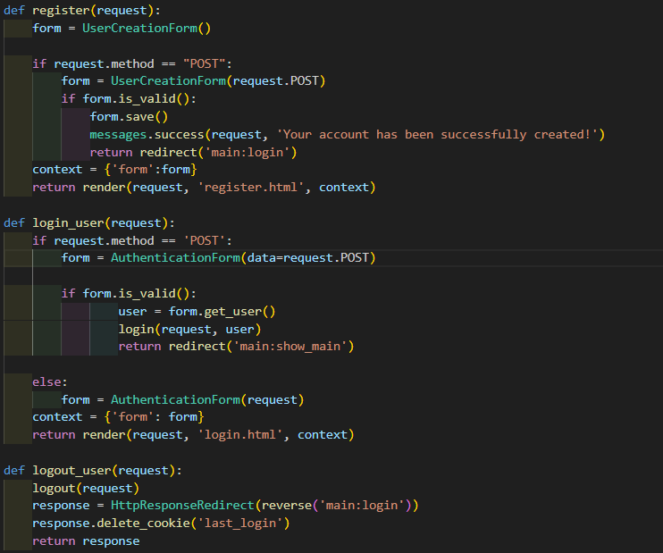

    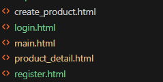

    b. Membuat dua (2) akun pengguna dengan masing-masing tiga (3) dummy data menggunakan model yang telah dibuat sebelumnya untuk setiap akun di lokal.

        i. Akun Pertama
    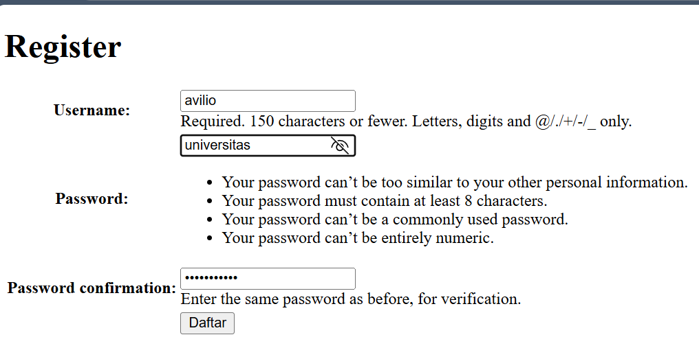

    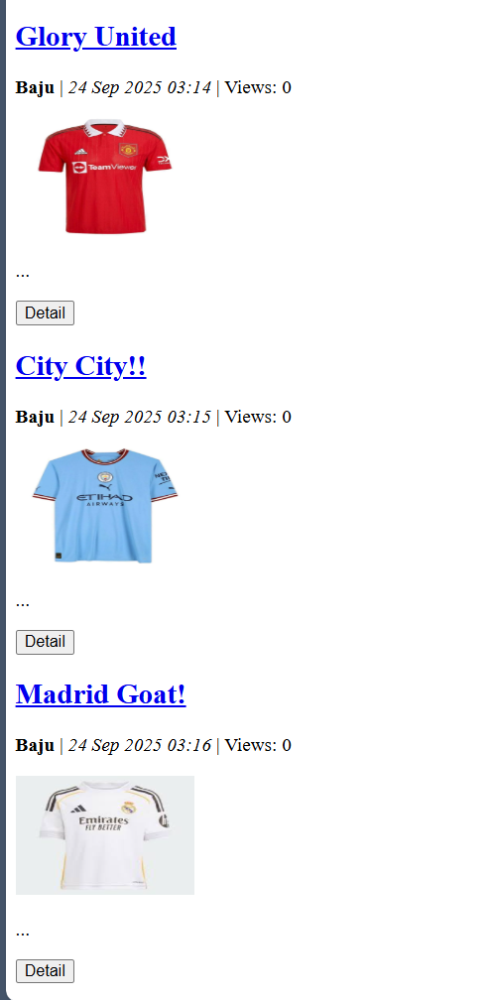

        ii. Akun Kedua
    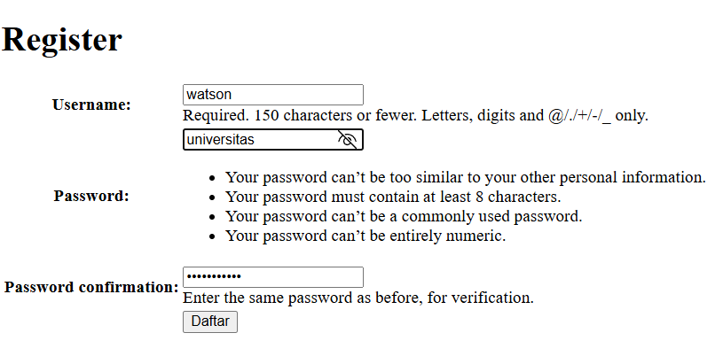

    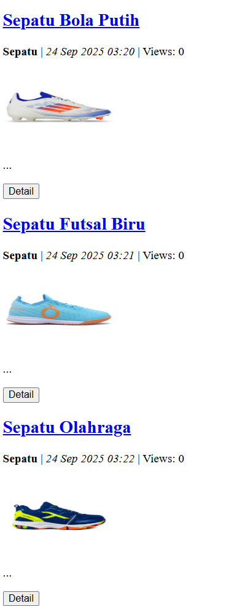

    c. Menghubungkan model Product dengan User.
        
        Pada model Product saya menambahkan kode 
    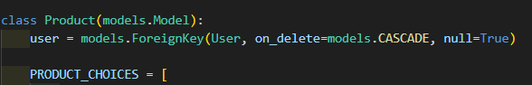
    
        lalu saya menambahkan kode @login_required(login_url='/login') pada fungsi show_main dan create_product

    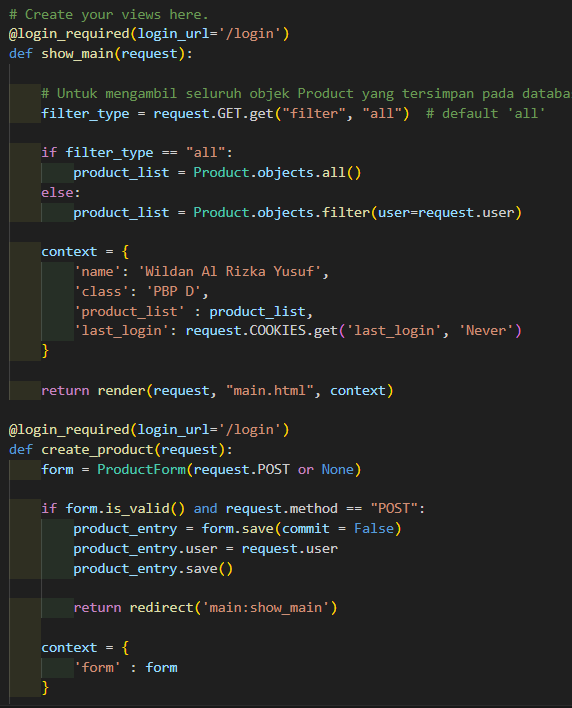

        saya juga menambahkan author pada produk yang dibuat, kode ini ditambahkan di file product_detail.html

    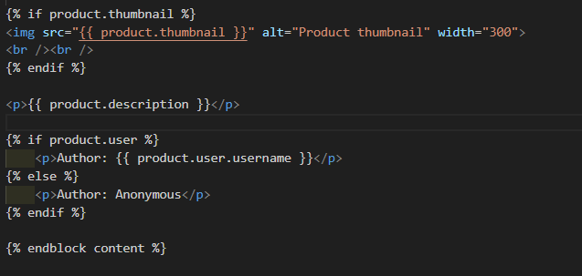

    c. Menampilkan detail informasi pengguna yang sedang logged in seperti username dan menerapkan cookies seperti last_login pada halaman utama aplikasi.

        Disini saya untuk mendapatkan last_login menggunakan cookies, saya menyimpan data logout terakhir user ke dalam last_login
    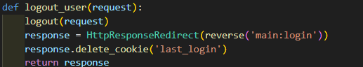

        Lalu saya menampilkannya pada show_main

    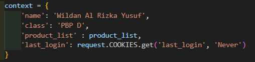

        Untuk menampilkan username pengguna, saat menyimpan username pengguna di variabel username
    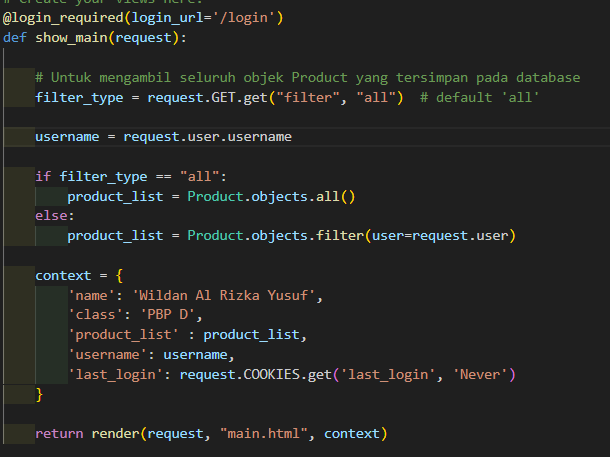

        Lalu saya menampilkannya di show_main

    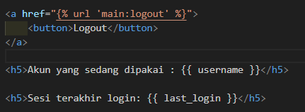

6. Melakukan add-commit-push ke GitHub.
    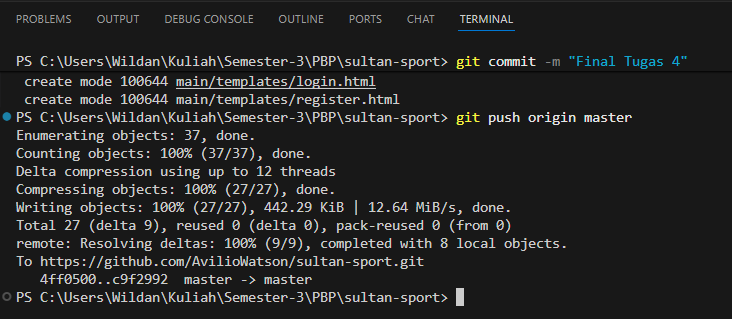

Tugas 5

1. Jika terdapat beberapa CSS selector untuk suatu elemen HTML, jelaskan urutan prioritas pengambilan CSS selector tersebut!
    
    Berdasarkan teori specificity dalam CSS, ada urutan prioritas yang menentukan selector mana yang lebih kuat. Pertama, selector dengan inline style (yang ditulis langsung pada atribut style di elemen HTML) memiliki prioritas tertinggi. Kedua, selector yang menggunakan ID akan lebih kuat dibandingkan selector lainnya. Selanjutnya, selector dengan class, pseudo-class (seperti :hover), atau atribut selector memiliki prioritas di bawah ID. Setelah itu, selector berbasis tag atau elemen HTML (misalnya p, h1, div) memiliki prioritas paling rendah. Jika dua selector memiliki tingkat spesifisitas yang sama, maka yang dituliskan paling terakhir dalam file CSS akan digunakan, karena prinsip the last rule wins. Dengan memahami urutan prioritas ini, kita sebagai mahasiswa yang belajar web development jadi lebih paham mengapa kadang ada style yang “tertindih” oleh aturan lain, dan bisa menuliskan CSS dengan lebih terstruktur serta efisien

2. Mengapa responsive design menjadi konsep yang penting dalam pengembangan aplikasi web? Berikan contoh aplikasi yang sudah dan belum menerapkan responsive design, serta jelaskan mengapa!

    Responsive design menjadi konsep yang sangat penting dalam pengembangan aplikasi web karena saat ini pengguna mengakses internet melalui berbagai perangkat dengan ukuran layar yang berbeda-beda, mulai dari smartphone, tablet, hingga desktop. Tanpa adanya desain yang responsif, tampilan aplikasi web bisa menjadi berantakan, sulit digunakan, atau bahkan tidak terbaca pada perangkat tertentu. Dengan menerapkan responsive design, tampilan website akan otomatis menyesuaikan ukuran layar, sehingga pengalaman pengguna (user experience) menjadi lebih baik dan konsisten di semua perangkat.

    Sebagai contoh, aplikasi Tokopedia sudah menerapkan responsive design. Jika kita membuka Tokopedia melalui smartphone maupun laptop, tampilan websitenya tetap rapi, tombol navigasi mudah dijangkau, dan konten produk bisa diakses dengan nyaman tanpa harus memperbesar layar secara manual. Hal ini memudahkan pengguna dalam berbelanja dan membuat mereka betah menggunakan aplikasinya. Sebaliknya, ada beberapa website lama dari instansi pemerintahan atau sekolah yang belum menerapkan responsive design. Saat dibuka di smartphone, tampilan tulisannya terlalu kecil, menu tidak terbaca dengan jelas, dan pengguna harus melakukan zoom in-out untuk bisa mengakses informasi. Kondisi ini jelas menyulitkan pengguna dan menurunkan efektivitas penyampaian informasi.

    Dari sini, kita bisa melihat bahwa responsive design bukan hanya soal estetika tampilan, tetapi juga sangat berpengaruh terhadap kenyamanan, keterjangkauan, dan keberhasilan sebuah aplikasi web dalam memenuhi kebutuhan penggunanya.

3. Jelaskan perbedaan antara margin, border, dan padding, serta cara untuk mengimplementasikan ketiga hal tersebut!

    Margin, border, dan padding adalah tiga komponen utama dalam konsep CSS box model yang digunakan untuk mengatur tampilan dan jarak elemen di halaman web. Margin adalah ruang kosong di luar elemen yang memisahkan elemen tersebut dari elemen lain di sekitarnya. Border adalah garis yang mengelilingi elemen, berada di antara margin dan padding, dan dapat diatur ketebalan, warna, maupun gaya garisnya. Padding adalah ruang di dalam elemen, antara konten elemen (misalnya teks atau gambar) dengan border, yang berfungsi agar konten tidak menempel langsung ke tepi elemen.

    Implementasinya dalam CSS dapat dilakukan seperti berikut

    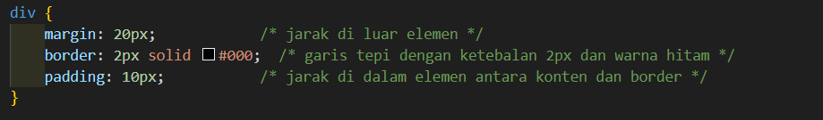

    Dengan pengaturan ini, elemen 
 memiliki jarak 20px dari elemen lain, garis tepi hitam setebal 2px, dan konten di dalam elemen memiliki ruang 10px dari border. Pemahaman margin, border, dan padding membantu membuat tampilan web lebih rapi, proporsional, dan nyaman dilihat.

4. Jelaskan konsep flex box dan grid layout beserta kegunaannya!

    Flexbox dan Grid Layout adalah dua metode CSS layout modern yang digunakan untuk mengatur posisi dan ukuran elemen di halaman web secara lebih fleksibel dan efisien dibandingkan metode tradisional seperti float atau inline-block.

    Flexbox (Flexible Box) berfokus pada layout satu dimensi, baik secara horizontal (row) maupun vertikal (column). Konsep utamanya adalah menjadikan elemen anak dalam sebuah kontainer fleksibel dalam mengisi ruang yang tersedia, menyesuaikan ukuran, urutan, dan jarak antar elemen secara otomatis. Flexbox sangat berguna ketika kita ingin membuat navigasi bar, daftar produk, atau card yang rapi dan sejajar tanpa harus menghitung margin manual.

    Grid Layout, di sisi lain, adalah layout dua dimensi, mengatur elemen baik secara baris (rows) maupun kolom (columns) secara bersamaan. Grid sangat cocok digunakan untuk desain kompleks seperti halaman dashboard, galeri gambar, atau layout majalah, karena memungkinkan penempatan elemen di posisi spesifik dengan lebih presisi.

    Singkatnya, Flexbox ideal untuk layout linier satu arah, sedangkan Grid Layout ideal untuk layout dua arah yang lebih kompleks. Keduanya memungkinkan pembuatan desain web yang responsif, rapi, dan mudah diatur tanpa bergantung pada trik CSS lama.

5. Jelaskan bagaimana cara kamu mengimplementasikan checklist di atas secara step-by-step (bukan hanya sekadar mengikuti tutorial)!
    
    Saya pertama membaca apa itu tailwind, kegunaannya, dan bagaimana cara menggunakanya, saya mempelajari bagaimana tailwind bisa membuat website menjadi lebih menarik, tentunya saya juga melakukan semua hal hal yang ada pada tutorial, namun saya juga bereksperimen tentang kegunaan tailwind di website sultan sport, saya juga meminta bantuan gpt untuk menjelaskan hal hal yang saya belum mengerti.

Tugas 6

1.  Apa perbedaan antara synchronous request dan asynchronous request?

    Synchronous request adalah jenis permintaan di mana browser akan menunggu respons dari server sebelum melanjutkan proses lainnya. Artinya, seluruh halaman akan berhenti sejenak sampai data yang diminta selesai diproses dan dikembalikan, biasanya ditandai dengan reload halaman penuh. Sedangkan asynchronous request memungkinkan browser mengirim dan menerima data dari server tanpa harus me-reload seluruh halaman. Dengan asynchronous, pengguna tetap bisa berinteraksi dengan halaman sementara data diambil di latar belakang. Contohnya adalah penggunaan AJAX atau Fetch API yang memperbarui sebagian elemen halaman secara dinamis tanpa gangguan terhadap elemen lain.

2.  Bagaimana AJAX bekerja di Django (alur request–response)?

    Ketika pengguna melakukan aksi di halaman (misalnya menekan tombol submit pada form), JavaScript di sisi klien akan mengirim permintaan AJAX ke URL tertentu di Django, biasanya menggunakan metode POST atau GET. Permintaan tersebut diteruskan ke view yang sesuai melalui sistem routing Django. View akan memproses data yang diterima, misalnya memvalidasi input, berinteraksi dengan database, atau menjalankan logika tertentu. Setelah selesai, view mengembalikan respons dalam format JSON (menggunakan JsonResponse). Di sisi klien, JavaScript kemudian menangkap respons ini, memprosesnya, dan memperbarui tampilan halaman tanpa perlu melakukan reload. Untuk keamanan, Django tetap memerlukan token CSRF yang dikirim bersama permintaan AJAX.

3.  Apa keuntungan menggunakan AJAX dibandingkan render biasa di Django?

    Keuntungan utama penggunaan AJAX adalah efisiensi dan kecepatan. Dengan AJAX, hanya bagian tertentu dari halaman yang diperbarui, bukan seluruh halaman. Hal ini membuat interaksi terasa lebih cepat dan ringan karena tidak perlu memuat ulang semua elemen. Selain itu, AJAX memberikan pengalaman yang lebih interaktif bagi pengguna, seperti validasi data secara langsung, pencarian instan, atau pemuatan data bertahap (lazy loading). AJAX juga membantu mengurangi beban server dan bandwidth karena data yang dikirim lebih sedikit dibandingkan render halaman penuh.

4.  Bagaimana cara memastikan keamanan saat menggunakan AJAX untuk fitur Login dan Register di Django?

    Untuk menjaga keamanan saat menggunakan AJAX, langkah pertama adalah memastikan semua komunikasi menggunakan protokol HTTPS agar data sensitif seperti password tidak mudah disadap. Setiap permintaan POST harus menyertakan token CSRF yang diverifikasi oleh Django agar mencegah serangan CSRF. Semua validasi input wajib dilakukan di sisi server, meskipun validasi di sisi klien juga bisa digunakan untuk kenyamanan pengguna. Password harus disimpan dengan hashing aman (Django sudah menyediakannya secara default), dan cookie sesi harus diberi atribut Secure, HttpOnly, dan SameSite. Selain itu, sistem login sebaiknya dilengkapi dengan pembatasan percobaan login (rate limiting) untuk mencegah brute-force attack.

5.  Bagaimana AJAX mempengaruhi pengalaman pengguna (User Experience) pada website?

    AJAX memberikan dampak positif yang signifikan terhadap pengalaman pengguna. Dengan AJAX, halaman web terasa lebih cepat dan responsif karena perubahan konten terjadi secara real-time tanpa reload penuh. Hal ini membuat interaksi seperti mengirim form, memuat data tambahan, atau menampilkan notifikasi menjadi lebih halus dan efisien. Pengguna tidak perlu menunggu lama atau melihat layar berkedip akibat refresh halaman. Namun, jika tidak diimplementasikan dengan baik, AJAX bisa menyebabkan kebingungan, misalnya jika tidak ada indikator loading atau navigasi browser tidak berfungsi normal. Oleh karena itu, penggunaan AJAX perlu disertai perhatian terhadap detail UX seperti feedback visual, pengelolaan history, dan aksesibilitas agar tetap ramah bagi semua pengguna.
