Link Deploy : https://wildan-al41-sultansport.pbp.cs.ui.ac.id/

Tugas 1

1.  Jelaskan bagaimana cara kamu mengimplementasikan 
checklist di atas secara step-by-step (bukan hanya sekadar mengikuti tutorial).

Sebelum masuk ke bagian cheklist, saya membuat repository baru bernama sultan-sport yang akan digunakan untuk mengerjakan tugas ini

    a. Membuat sebuah proyek Django baru.

        Saya mendownload semua requirements untuk django terlebih dahulu, detailnya ada di file requirement.txt
        Setelah itu saya membuat proyek django bernama sultan_sport serta mengkonfigurasikan variables dan proyek django nya

    b. Membuat aplikasi dengan nama main pada proyek tersebut.

        Saya membuat aplikasi baru bernama main dalam proyek sultan_sport degan perintah python manage.py startapp main, lalu saya juga mendaftarkan aplikasinya di setting.py di proyek sultan_sport, lebih tepatnya dibagian INSTALLED_APPS

    c. Melakukan routing pada proyek agar dapat menjalankan aplikasi main.

        Untuk melakukan routing, pertama - tama saya membuat berkas urls.py di main, lalu mengisi filenya dengan kode 

        from django.urls import path
        from main.views import show_main

        app_name = 'main'

        urlpatterns = [
            path('', show_main, name='show_main'),
        ]

    d. Membuat model pada aplikasi main dengan nama Product dan memiliki atribut wajib sebagai berikut.

        Dalam membuat model, sebenarnya saya menggunakan template dari tutorial 1, tapi saya merubahnya seperti ketentuan tugas 2, yang saya rubah antara lain, merubah namanya dari News menjadi Product, lalu merubah CATEGORY_CHOICES menjadi PRODUCT_CHOICES serta merubah isi dictionarynya. Saya juga merubah atribut nya seperti ketentuan yang ada di tugas 2 tetapi saya menambahkan 2 atribut baru yaitu adress dan stock

    e. Membuat sebuah fungsi pada views.py untuk dikembalikan ke dalam sebuah template HTML yang menampilkan nama aplikasi serta nama dan kelas kamu.

        Saya membuka berkas views.py di folder main, lalu saya memberikan fungsi show_main yang berisikan nama dan npm saya, lalu di file main.html nya saya panggil kembali nama dan kelas saya dari file views.py, lalu saya menambahkan judul di berkas main.html saya

    f. Membuat sebuah routing pada urls.py aplikasi main untuk memetakan fungsi yang telah dibuat pada views.py.
        
        saya membuka berkas urls.py di folder sultan-sport, saya menambahkan kode

        from django.urls import path, include

        serta menambahkan kode

        path('', include('main.urls')),

        didalam url pattern

    g. Melakukan deployment ke PWS terhadap aplikasi yang sudah dibuat sehingga nantinya dapat diakses oleh teman-temanmu melalui Internet.

        Saya membuka website pws, lalu membuat project baru, lalu saya hubungkan pws itu kedalam proyek saya, awalnya saya bingung kenapa selalu gagal build, ternyata saya lupa untuk ngepush git saya ke pws, ini memakan 1 jaman lebih :' .

2. Buatlah bagan yang berisi request client ke web aplikasi berbasis Django beserta responnya dan jelaskan pada bagan tersebut kaitan antara urls.py, views.py, models.py, dan berkas html.

    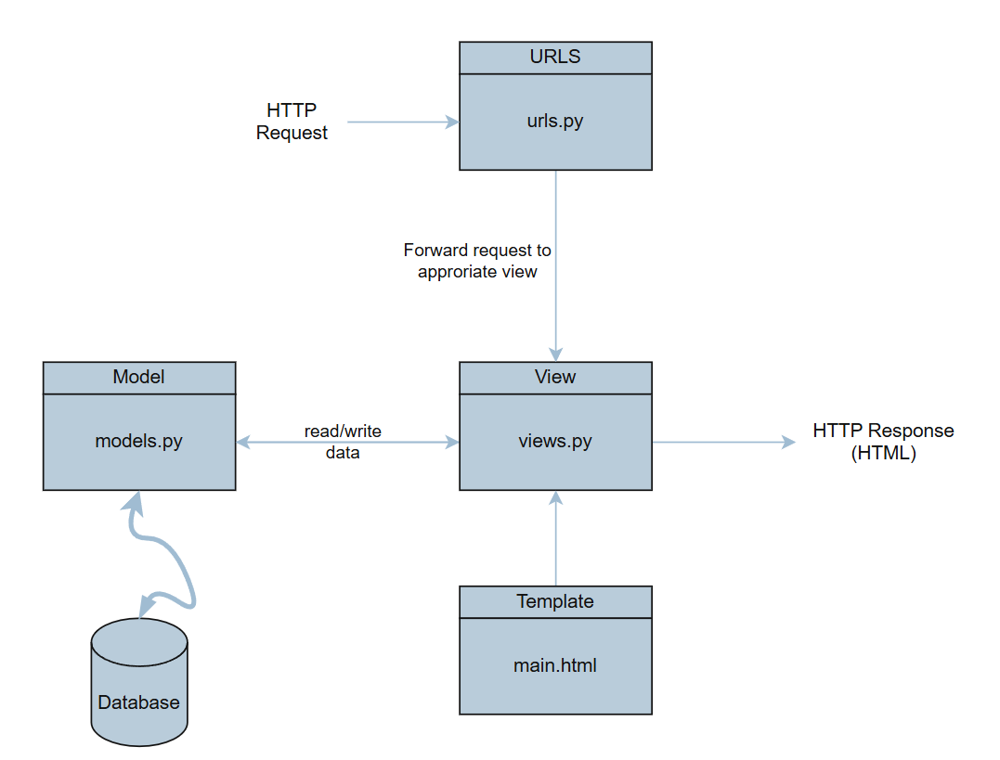

3. Jelaskan peran settings.py dalam proyek Django!

    Dalam proyek Django, settings.py berfungsi sebagai pusat pengaturan utama yang mengendalikan cara aplikasi berjalan. Di dalamnya tersimpan konfigurasi penting, mulai dari aplikasi apa saja yang digunakan, middleware yang aktif, hingga bagaimana proyek terhubung dengan database. File ini juga mengatur aspek keamanan, seperti secret key, daftar host yang diizinkan, serta status debug untuk membedakan antara lingkungan pengembangan dan produksi. Selain itu, settings.py memuat aturan mengenai lokasi file statis dan media, pengaturan bahasa serta zona waktu, bahkan konfigurasi tambahan seperti email, autentikasi, dan logging. Dengan kata lain, settings.py adalah jantung pengaturan proyek Django yang memastikan semua komponen dapat bekerja selaras sesuai kebutuhan aplikasi.

4. Bagaimana cara kerja migrasi database di Django?

    Dalam Django, migrasi database bekerja sebagai jembatan antara model yang ditulis di Python dengan struktur tabel yang ada di database. Setiap kali pengembang membuat atau mengubah model, Django tidak langsung mengubah database, melainkan mencatat perubahan tersebut dalam sebuah file migrasi. File inilah yang berisi instruksi tentang apa yang harus ditambahkan, diubah, atau dihapus di dalam tabel. Setelah itu, ketika migrasi dijalankan, Django menerjemahkan instruksi tersebut menjadi perintah SQL dan mengeksekusinya ke database. Dengan cara ini, database selalu mengikuti perkembangan model tanpa perlu menulis query manual, sekaligus menjaga riwayat perubahan agar mudah dilacak atau dikembalikan jika diperlukan.

5. Menurut Anda, dari semua framework yang ada, mengapa framework Django dijadikan permulaan pembelajaran pengembangan perangkat lunak?

    Django sering dijadikan permulaan dalam pembelajaran pengembangan perangkat lunak karena sifatnya yang terstruktur, lengkap, dan ramah untuk pemula sekaligus kuat untuk proyek nyata. Django membawa filosofi “batteries included”, artinya sebagian besar fitur penting untuk membangun aplikasi web sudah tersedia tanpa perlu memasang banyak tambahan—mulai dari autentikasi pengguna, sistem manajemen database, hingga keamanan dasar. Hal ini membantu pemula agar bisa fokus memahami konsep inti pengembangan perangkat lunak, bukan sibuk dengan detail teknis yang terpecah-pecah.

    Selain itu, Django menerapkan pola arsitektur MTV (Model-Template-View) yang serupa dengan konsep MVC, sehingga pengembang sejak awal terbiasa dengan pembagian tanggung jawab kode secara rapi dan terstruktur. Django juga menekankan praktik terbaik, seperti keamanan default, penggunaan ORM untuk mengelola database, serta dukungan migrasi yang membuat perubahan skema lebih mudah dan terkontrol.

    Dengan dokumentasi yang lengkap, komunitas besar, dan ekosistem yang matang, Django memberi pengalaman belajar yang tidak hanya teoritis, tetapi juga relevan dengan kebutuhan industri. Karena itulah, banyak program atau kursus menjadikannya framework awal agar mahasiswa atau pemula bisa memahami alur kerja sebuah aplikasi web modern secara menyeluruh sebelum melangkah ke teknologi lain yang lebih spesifik atau ringan.

6. Apakah ada feedback untuk asisten dosen tutorial 1 yang telah kamu kerjakan sebelumnya?

    Mungkin jika berkenan, untuk setiap tugas atau tutorial yang telah dilakukan, bisa berikan feedback agar saya tahu dimana kurangnya saya dalam mengerjakan tugas, terimakasih

Tugas 2
1. Jelaskan mengapa kita memerlukan data delivery dalam pengimplementasian sebuah platform?
    Dalam implementasi sebuah platform, data delivery diperlukan untuk memastikan proses pertukaran data antar komponen sistem berjalan dengan baik. Platform umumnya terdiri dari berbagai bagian seperti frontend, backend, database, dan layanan eksternal. Agar seluruh bagian ini dapat bekerja secara terpadu, diperlukan mekanisme yang dapat mengirimkan data secara cepat, aman, dan konsisten.

    Data delivery berperan penting dalam menjaga konsistensi data, sehingga informasi yang dikirimkan tidak hilang atau berubah selama proses pengiriman. Selain itu, mekanisme ini mendukung kebutuhan pemrosesan data secara real-time, yang menjadi ciri banyak platform modern. Dengan adanya data delivery, sistem juga dapat menangani pertumbuhan jumlah pengguna atau beban kerja yang semakin besar, karena arus data dapat diatur dengan efisien.

    Data delivery juga memungkinkan platform untuk berintegrasi dengan layanan pihak ketiga, seperti sistem pembayaran atau API eksternal. Di sisi lain, data yang sampai dengan benar dan tepat waktu dapat dimanfaatkan untuk analisis dan pengambilan keputusan strategis.

    Itulah kenapa data delivery merupakan komponen yang sangat penting dalam pengimplementasian platform, karena menjadi dasar agar sistem dapat berjalan secara andal, terukur, dan mampu memenuhi kebutuhan pengguna.

2. Menurutmu, mana yang lebih baik antara XML dan JSON? Mengapa JSON lebih populer dibandingkan XML?
    Menurut saya, JSON lebih baik dari XML, namun walaupun begitu, XML maupun JSON sama-sama berfungsi sebagai format pertukaran data, tetapi keduanya memiliki karakteristik yang berbeda. XML memiliki struktur berbasis tag yang cukup kompleks, sementara JSON menggunakan format key-value yang lebih sederhana.

    JSON lebih unggul karena lebih ringkas dan efisien. Struktur JSON tidak memerlukan tag pembuka dan penutup seperti pada XML, sehingga ukuran data yang dikirim menjadi lebih kecil. Hal ini tentu menghemat bandwidth sekaligus mempercepat proses pengiriman data. Selain itu, JSON juga lebih mudah dibaca oleh manusia maupun mesin karena sintaksnya mirip dengan objek di banyak bahasa pemrograman.

    Dari sisi implementasi, JSON lebih praktis karena dapat langsung di-parse menjadi objek native pada bahasa pemrograman modern, terutama JavaScript. Hal ini membuat JSON sangat cocok untuk kebutuhan aplikasi web dan mobile yang menuntut kinerja cepat. Sedangkan pada XML, parsing membutuhkan langkah tambahan sehingga cenderung lebih berat.

    Meskipun demikian, XML tetap memiliki kelebihan tertentu. XML mendukung skema, namespace, serta validasi dokumen yang lebih ketat. Fitur ini menjadikan XML lebih cocok digunakan dalam sistem-sistem enterprise atau standar lama yang membutuhkan aturan formal dalam pertukaran data. Karena alasan ini, XML masih digunakan di beberapa sektor, meskipun popularitasnya menurun.

    Secara keseluruhan, JSON lebih populer dibandingkan XML karena kesederhanaan, efisiensi, dan kemudahan integrasinya dengan teknologi modern. Sementara itu, XML masih relevan di beberapa konteks tertentu, terutama pada sistem lama yang sudah terbentuk dan mengandalkan fitur validasinya.

3. Jelaskan fungsi dari method is_valid() pada form Django dan mengapa kita membutuhkan method tersebut?

    Dalam Django, method is_valid() pada form digunakan untuk melakukan validasi terhadap data yang dikirimkan melalui form. Ketika pengguna mengisi form dan mengirimkan data ke server, Django akan menampung data tersebut di dalam objek form. Dengan memanggil is_valid(), Django akan memeriksa apakah data yang masuk sudah sesuai dengan aturan validasi yang didefinisikan pada form, misalnya tipe data, panjang karakter, kewajiban field (required), maupun aturan custom yang kita tentukan sendiri.

    Jika semua data memenuhi aturan validasi, maka is_valid() akan mengembalikan nilai True, dan data yang sudah bersih (cleaned data) bisa diakses melalui atribut form.cleaned_data. Sebaliknya, jika ada data yang tidak valid, maka is_valid() akan mengembalikan False, dan Django secara otomatis akan menyimpan pesan error di dalam objek form. Pesan error ini kemudian bisa ditampilkan kembali ke pengguna agar mereka tahu bagian mana yang perlu diperbaiki.

    Kita membutuhkan method ini karena validasi data merupakan bagian yang sangat penting dalam membangun aplikasi web. Tanpa validasi, data yang masuk ke sistem bisa saja salah, tidak sesuai format, bahkan berpotensi membahayakan aplikasi (misalnya serangan injeksi). Dengan adanya is_valid(), Django membantu developer untuk memastikan hanya data yang valid yang akan diproses dan disimpan ke database.

4.  Mengapa kita membutuhkan csrf_token saat membuat form di Django? Apa yang dapat terjadi jika kita tidak menambahkan csrf_token pada form Django? Bagaimana hal tersebut dapat dimanfaatkan oleh penyerang?

    Dalam Django, csrf_token digunakan untuk melindungi aplikasi dari serangan Cross-Site Request Forgery (CSRF). CSRF adalah jenis serangan di mana penyerang mencoba memanfaatkan sesi pengguna yang masih aktif untuk menjalankan aksi tertentu di aplikasi tanpa sepengetahuan pengguna tersebut.

    Dengan adanya csrf_token, setiap form yang dikirimkan ke server akan menyertakan token unik yang hanya valid untuk sesi pengguna tersebut. Django kemudian akan memverifikasi token ini sebelum memproses data form. Jika token tidak ada atau tidak cocok, maka permintaan akan ditolak.

    Apabila kita tidak menambahkan csrf_token pada form, maka aplikasi menjadi rentan terhadap serangan CSRF. Misalnya, seorang pengguna sedang login di sebuah aplikasi bank berbasis Django. Tanpa perlindungan CSRF, penyerang bisa membuat sebuah halaman berisi form tersembunyi yang, ketika diakses oleh korban, secara otomatis mengirimkan request ke aplikasi bank untuk melakukan transfer uang. Karena pengguna masih login, request tersebut akan dianggap sah oleh server, padahal sebenarnya pengguna tidak pernah berniat melakukan aksi tersebut.

    Dengan kata lain, tanpa csrf_token, penyerang dapat memanfaatkan sesi pengguna yang aktif untuk melakukan tindakan berbahaya seperti mengubah data, melakukan transaksi, atau bahkan mengambil alih akun. Inilah alasan mengapa csrf_token sangat penting untuk keamanan aplikasi web yang dibuat dengan Django.

5.  Jelaskan bagaimana cara kamu mengimplementasikan checklist di atas secara step-by-step (bukan hanya sekadar mengikuti tutorial).

    a. Tambahkan 4 fungsi views baru untuk melihat objek yang sudah ditambahkan dalam format XML, JSON, XML by ID, dan JSON by ID.

        Untuk menambahkan 4 fungsi views, buka dulu views.py, lalu tambahkan didalamnya fungsi fungsi baru tersebut.
    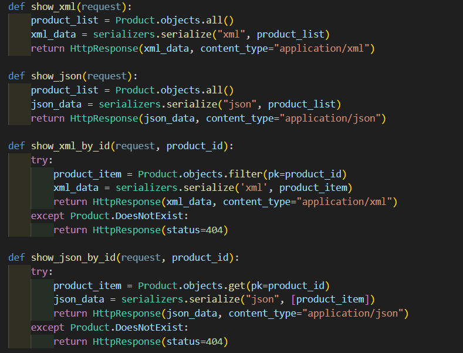

    b. Membuat routing URL untuk masing-masing views yang telah ditambahkan pada poin 1

        Buka urls.py di folder main, lalu tambahkan routenya didalam urlspattern agar dapat mengakses fungsi views jika ada permintaan
    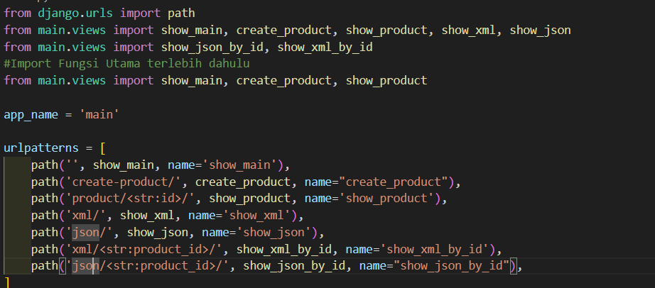

    c. Membuat halaman yang menampilkan data objek model yang memiliki tombol "Add" yang akan redirect ke halaman form, serta tombol "Detail" pada setiap data objek model yang akan menampilkan halaman detail objek.

        Update isi main.html dan tambahkan tombol Add Product yang akan mengembalikan halaman create_product.html, 
    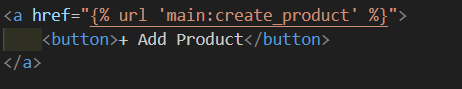
        lalu juga tambahkan tombol detail yang akan mengembalikan fungsi show_product yang mereturn halaman product_detail.html
    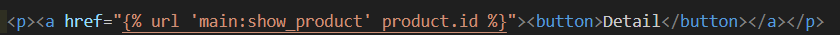

    d.Membuat halaman form untuk menambahkan objek model pada app sebelumnya.

        buat form di forms.py yang memiliki field yang sama seperti yang ada di model
    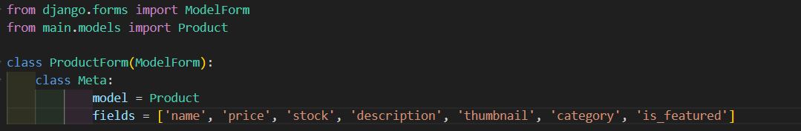

    e. Membuat halaman yang menampilkan detail dari setiap data objek model.

        Buat file product_detail.html lalu isi dengan detail yang ingin diperlihatkan ke user
    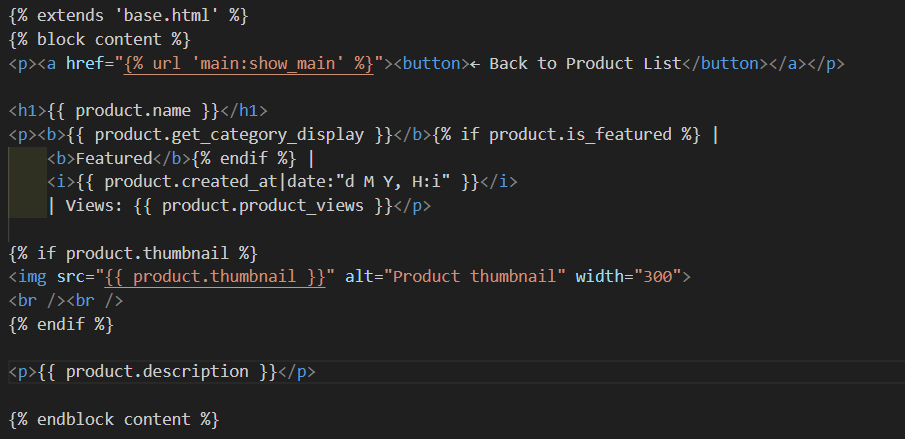

6. Mengakses keempat URL di poin 2 menggunakan Postman, membuat screenshot dari hasil akses URL pada Postman, dan menambahkannya ke dalam README.md.

    JSON
    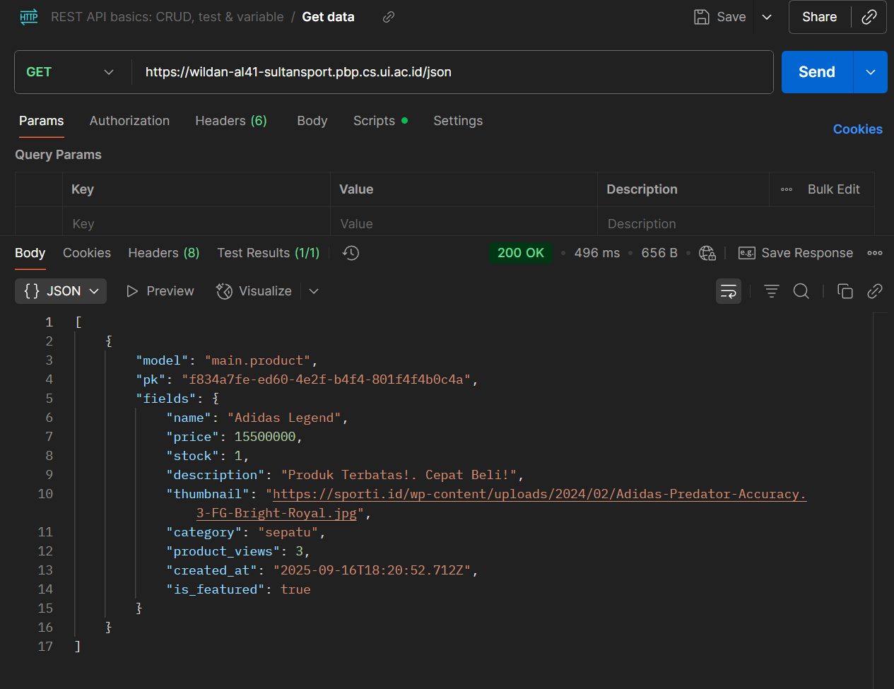
    
    XML
    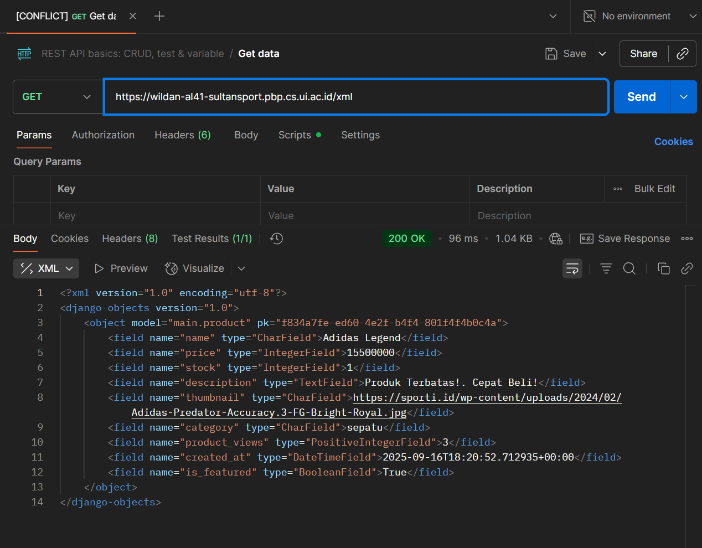

    JSON by Id
    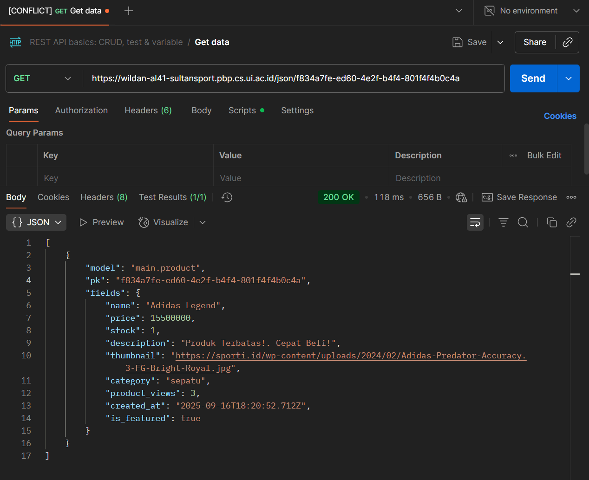

    XML by Id
    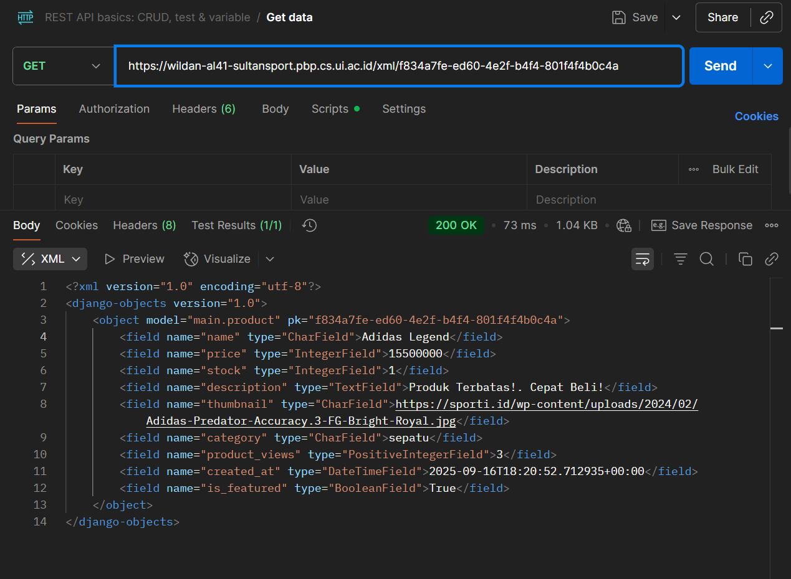

7. Apakah ada feedback untuk asdos di tutorial 2 yang sudah kalian kerjakan?
    Asdos menjawab pertanyaan dengan detail dan membuat saya menjadi mengerti, namun saya tetap ingin ada update apakah tutorial yang saya kerjakan sudah benar atau tidak setelah deadline nya selesai.
